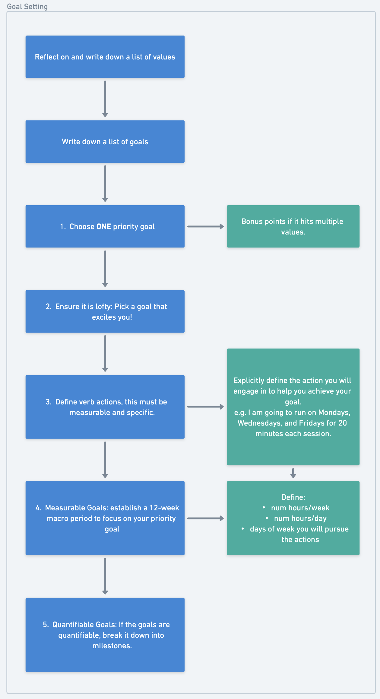

If you are goal-curious, have set goals in the past, and haven't quite hit them or have goals and smashed them, keep reading; you will probably learn something anyway.

**Grab a pen or pencil and two pieces of paper (or your Remarkable if you're fancy like that)**: one piece of paper for "brainstorming" and the other one as the "final draft." Writing things out on paper engages your neural circuitry differently than typing them out; Huberman said it, so do it! You can always convert it to digital if you have a personal knowledge tool you want to store it in.

## What is a goal?

Dictionary definition: **"The object of a person's ambition or effort; an aim or desired result"**

But you should ask: what shapes these ambitions or desired results? The answer is simple: **your values**.

Your goals reflect your values; if you want to learn an instrument, you value creativity and learning; if you want to lose weight or build muscle, you value physical health. Your values may have come from deep reflections, but it's likelier they are primarily influenced by external factors: your parents, society, friends, etc.

Before setting your goals, it's important to reevaluate whether your values align with **you** internally. Does living out these values reflect the person **you** want to be and the lifestyle **you** want, not if the values align with your mom, dad, or your high school English teacher?

More aptly, set goals to **impress yourself**, NOT others.

**Actionable: Explicitly write a list of values you hold, e.g., physical health, freedom, etc.**

## Why set goals?

Setting goals is making a contract with yourself, indicating that you want to better yourself and, thus, the lives of those around you. By no means does this mean you shouldn't feel grateful and content with where you are currently, but it's nice to have something to strive for, to have the agency to pick your struggle and purpose?

**Actionable: Ask yourself if you care about goals. If you do, write out a list of goals you want to achieve.**

## How to set goals?

The inspiration for writing this article is the [Goals Toolkit podcast by Andrew Huberman](https://www.youtube.com/watch?v=CrtR12PBKb0).

I intend to distill and capture the essence of his 1.5-hour-long podcast so that the main points are captured and digestible in 15-20 minutes while still being just as helpful. Here goes:

### Goal Setting

I will provide an example of goal setting for someone who wants to build muscle.

1.  Choose **ONE** priority goal.

    **Actionable: Write out a list of goals you want to accomplish and pick the one you want to do the most OR eliminate all the ones you are willing to put on hold.**

    Too many goals lead to a lack of focus (I have been guilty of this every year). This forces a singular focus and will lead to actual outcomes.

    Bonus: A goal which hits multiple values and/or forces you to execute multiple actions

    Example: I want to build muscle and be bigger and stronger.

2.  Make the goal lofty, if it isn't already.

    **Actionable: Take the goal you have thought of and ensure that it is something you would be thrilled to achieve. It should be slightly out of reach.**

    This ensures that the goal will excite your brain enough to want to pursue it. It should be safely uncomfortable during the pursuit.

    Example: I want to build 1.5% of my lean mass weight of muscle per month (top range for beginners).

3.  Utilize verb actions.

    **Actionable: Define the action verb. What specific action do you need to engage in to reach your goal?**

    Example: I am going to go to the gym, and I will eat more protein.

4.  Make it measurable and specific.

    **Actionable: Now, you must define one thing:**

    1. How much time will you spend pursuing that goal every day/week? Taking the bigger goal and breaking it down into smaller components is a problem-solving skill and requires critical thinking. Start by defining how much time you will have each week and day and which days you will pursue that goal.

    How long will you pursue this goal? We set the length of pursuit to be **a quarter of the year (3 months)**; this aligns with seasons, work schedules, and the rhythm of society. It is short enough to create urgency and long enough to make noticeable progress.

    Note: You might have to scale your goals down so that they can be accomplished in a quarter. It is also helpful to start small to first build up the habit so that it is sustainable in the long term.

    Example: I will go to the gym on Monday, Wednesday, and Friday for one hour per session while following the Stronglifts routine.
    I will consume 150g of protein daily, consuming 30g of protein five times daily. I will drink protein shakes twice daily and spend 2 hours every Sunday to meal prep the protein I consume for the following week.

5.  Make it quantifiable.

    Break the goal down into steps, and set milestones. Start with your starting point and update and track your progress over time. This may only sometimes be possible because some goals are Pass/Fail (e.g., I will switch careers).

    This has multiple effects: it keeps you accountable, it can be motivating to see the progress you've made and that you've stuck to your process consistently (sometimes the results are out of your control). Nonetheless, tracking your progress is helpful as your results can be an indicator of whether you need to adapt your actions in any way if you aren't where you want to be.

    **Actionable: Define a way to quantify your goal by the result and by the process (e.g., I followed through and did X action Y times)**

    Examples:

    - Result: I currently weigh 70kg with 60kg of lean mass. After a month, I should weigh 70.9kg; after two months, I should weigh 71.8kg; by the end, I'll be 72.7kg. Unfortunately, muscle growth does not compound when you're natty.
      You can weigh yourself daily or bi-weekly to see if you are on track and to reassess and adapt if you need to adjust anything along the way.
    - Process: I went to the gym 11 times the last month, missed one session, and consumed 150g of protein daily.

## Tips on consistently executing the actions

### "Protocols"

1.  Visualization of the End - For starting the action

    Ask yourself if you feel motivated to pursue the goal. Do you want to do the things to accomplish the goal? Is there resistance?
    If you are feeling motivated, spend 1-5 minutes visualizing the positive outcome of reaching your goal; try to imagine how you would feel.

    If you aren't feeling motivated, spend 1-5 minutes visualizing how bad you would feel if you failed and didn’t achieve your goals. Meditate on the fact that you're failing and not succeeding. Think about how you would feel at the end of the 12 weeks.

2.  Visual Target - For sustaining focus

    If you are starting to feel a lack of motivation or focus in your training block, pick a physical visual target roughly the same distance as your work, set a timer for 30-90 seconds, and stare at it.

    This has been shown to lead to a decreased perceived effort when engaging in the work and completing the work in a reduced amount of time. This focus on visual attention causes the release of neurochemicals, which increase alertness in your brain and body. Relaxing your visual focus, turn off this release.

3.  Put your damn phone away

    This is to eliminate distractions, and your phone is likely your most significant source of distractions. Increase the amount of friction it takes to pick up your phone.

4.  Random, intermittent reinforcement (rewarding)

    You can utilize rewards to prime your brain to release dopamine when carrying out your verb actions for your goal, as anticipatory dopamine release is more robust than the actual release upon reward consumption.

    The idea here is not to reward yourself every time but to do it instead randomly, flip a coin, or use a random generator online.

    This is the same way slot machines or the TikTok algorithm work, making both addictive.

5.  Time Chunking

    Motivation levels for a goal often start relatively high, wane in the middle, and rise again before the end. During this "middle problem,” you should:

    1. acknowledge the lower levels of motivation
    2. break up the lower motivation time into three smaller chunks of time, utilizing the other protocols: visualization of the end, visual target, etc.

6.  Circadian Rhythm and Attention

    The most important thing is **engaging in the action verb for your goal pursuit**.

    However, there are three times during the day when you have the most significant focus and attention: 30 minutes, 3 hours, and 11 hours after waking. Consider this a flexible rule!

    This relates to the idea, "manage your energy, not your time.” If you are a morning person, allocate time in the morning towards your priorities, and vice versa for the night. E.g.

## Myths/Don't Do's

1. "Visual Reminder Myth"

   If you use visual reminders (e.g., post-it notes), write it down daily and put it somewhere different.

   Having a visual cue somewhere you see daily isn't helpful because your visual system adapts and gets used to the environment. This allegedly diminishes the likelihood of progress.

2. "Accountability Myth"

   This is the "don't tell the world" rule. Keep your goal to yourself. When we tell our goals to people around us, the feedback usually is positive; this activates reward systems in our brain, which quickly dissipate and diminish the probability we engage in the actions that will lead us to achieve our goal.

## Closing Remarks

If you've done any goal setting in the past, a lot of this looks familiar. If there's one thing to take away from this article, the most important thing is executing the actions needed to bring you closer to your desired result.

These tools and techniques increase the probability of starting and sticking with some goals, but none of them means anything if you don't carry out the actions you have put in place.

So if you have correctly set up a goal, stop reading and spend one minute executing the action (or a mini version if you aren't in the environment), that's it, just one minute.

I hope you found this distillation on goals helpful. If you want tweets about various topics, follow me on [X/Twitter](https://twitter.com/0xdavinchee)!
