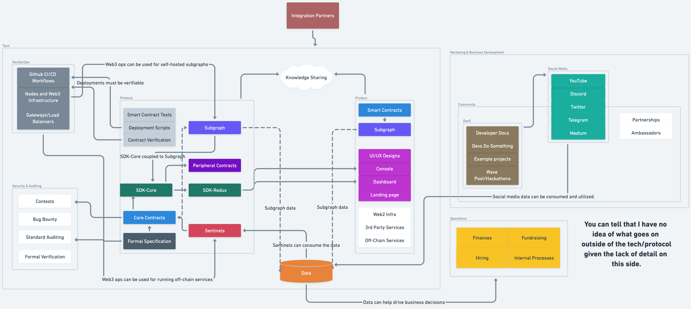

_A brief summary of the good, the bad, and the ugly of my time in Web3 and some useful takeaways._

It seems that running a company is complex, who would've known!

*My perspective of Superfluid and the different parts of the company as an IC working mainly on the protocol.*

**Disclaimer: The views expressed in this post are my own and do not represent those of my employer or any other entity.**

## Intro

I joined Superfluid on August 2021 during that whole COVID-19 thing (member dat?). Since diving into Web3, I've been entrenched in this space, and after reflecting on my experiences, I have gained some insights that others might find valuable.

> "If you want to go fast, go alone; if you want to go far, go together." My teammates have played a crucial role in my growth by challenging me, mentoring me, and sharing their knowledge.

## Experiences

During my time in Web3, I've been blessed to work across the Web3 stack, giving me a deep understanding of how the different pieces fit together, from high-level concepts to low-level implementation details. I've had the opportunity to revamp our SDK and Subgraph and write new features for our core contracts. I have learned **a lot** and still have much more to learn. But, I now have a better idea of what works well and what I'd do differently, either because of new tooling or general lessons learned from experience.

## Takeaways

> ### "Be explicit about the purpose and essence. Go back to first principles."

Understanding the **why** is essential whenever you undertake any endeavor. 

Ask: __*what is the essence of what I am trying to accomplish*__?

Then ask, [__*is the problem the problem*__](https://www.samuelthomasdavies.com/elevator-waiting-times/)?

Regularly challenging your assumptions can reveal that your initial problem might not be the root problem and can reveal alternative, more straightforward solutions to the fundamental issue.

> ### "Avoid sunk-cost fallacy: adapt or die."

You risk becoming obsolete if you fail to evaluate and adopt new tooling and learn how to maximize its potential despite switching costs or tossing work you invested time into, as teams that embrace and leverage new tools will outperform and execute more effectively than you. Imagine not leveraging LLMs right now.

I do not advocate constantly switching to every new shiny toy as you'd go nowhere, but rather to evaluate whether using a new tool provides outsized returns relative to any upfront switching costs. Things to consider when using a new tool: the team behind it, their financial backing, and the long-term prospects of it. Be self-reliant for critical parts of your business (if a third-party rugging you means you get rekt, you better have a backup).

In the case of Superfluid, there are a few things we've built that I believe have been made partially or fully redundant due to the new tooling available:

- **SDK-Core**: [`viem`](https://viem.sh/) did not exist, providing a low-level un-opinionated API leverages both the tool itself and developers' prior knowledge of how to use it. You can focus on teaching them about your protocol instead of how to use *yet another tool*.
- **SDK-Redux**: [`wagmi`](https://wagmi.sh/) and [`wagmi-cli`](https://wagmi.sh/cli/getting-started) did not exist. Similar to SDK-Core, this was an opinionated way of doing things. These next-gen tools automate a lot of what we aimed to accomplish for Superfluid by generating hooks (for react) that are plug-n-playable. And these tools do it for any contracts. The only required bundling/maintenance is providing the ABIs, the contract addresses on different networks, and examples of how to use these tools.
- **Subgraph integration tests**: [`matchstick`](https://github.com/LimeChain/matchstick) did not exist. The integration tests aimed to ensure that the data on the subgraph was correct. This involved storing the state locally in the tests, which `matchstick` does.
- **JS Truffle operation scripts**: `hardhat` did not exist. Using TypeScript and leveraging something like [hardhat-deploy](https://github.com/wighawag/hardhat-deploy) or [hardhat-ignition](https://github.com/NomicFoundation/ignition/) (when production-ready) would make it far easier to modify, reason about, and test such a crucial part of the business.
- **TS Hardhat tests**: [`foundry`](https://github.com/foundry-rs/foundry) did not exist. Using `foundry`: build and test times that are multiples faster, less context switching between JS and Solidity, [fuzz testing](https://book.getfoundry.sh/forge/fuzz-testing), [invariant testing](https://book.getfoundry.sh/forge/invariant-testing) and even [mutation testing](https://github.com/foundry-rs/foundry/issues/478) down the line.

It is vital to recognize that building in house-tools often carries heavy maintenance overhead (testing, bug fixes, adding features). It is usually better to leverage tools built by those who spend most of their waking hours thinking about and working on that tool (good ol' comparative advantage).

> ### "Don't underestimate internal developer experience/ergonomics."

Humans are lazy by nature and seek the path of least resistance. There is an inverse correlation between friction between you and solving a problem and the amount of time spent working on that problem.

The developer tooling and environment should be set up for immediate productivity and a smooth experience until a staging build or production release, where heavy friction is encouraged and desired. You are doing well if the dev environment is **mostly** invisible, and you can contribute with minimal to no friction.

Do your best to make sure your daily struggles are meaningful.

> ### "Listen to your implementers."

All companies have two critical roles: the decision-makers who strategize and the implementers who drive initiatives forward. At smaller companies, everyone is a mix of both, but people often have an explicit primary role. The relationship between the positions is symbiotic, and both are necessary: implementation without strategy leads nowhere, and strategy without implementation is theory.

Weigh opinions logically when it comes to making decisions, place more weight if multiple people are saying the same thing, and the outcome of a decision directly impacts their day-to-day. The opinion of those who have less lived experience on the subject or whose day-to-day is unaffected by the decision should carry far less weight.

## Closing remarks

Most of this might seem like common sense, but like most ideas, it is. The tricky part is the execution. A regular feature of growth and improvement is reflecting and finding better ways of doing things you previously did. This is often a sign of adaptation to an oxymoron: **the only constant in life is change**.

I hope you enjoyed this high level overview of my experience in Web3, if you're interested in Web3, follow me on [Twitter](https://twitter.com/0xdavinchee)!